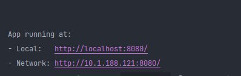
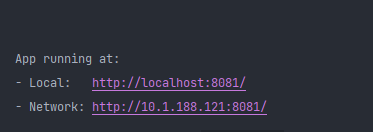

# [ad-astra 视频网站V1.0（项目汇报版）](http://adastra.isamumu.cn/#/)

项目持续维护中.......

[前端地址](https://gitee.com/arturiamu/libilibi-web) | [后端地址](https://gitee.com/arturiamu/libilibi-host.git)

## 关于`ad-astra`

`ad-astra`是一个由基于`前后端分离`架构的**个性化视频推荐**
网站，该网站收录了B站内包含舞蹈、音乐、动画、电影等在内的20种类型、共计20余万条视频和大量实时直播，供用户免费观看，同时也实现了用户对视频的点赞、收藏和用户间的交流功能，用户个人主页、会员功能，以及管理员对用户、视频的管理功能。

更多功能持续更新中...

## 环境准备

- 你需要安装`mysql 8.0.29`或其他能够兼容此版本的`mysql`数据库
- 你需要安装`Redis 3.2.100`或其他能够兼容此版本的`Redis`数据库你的 `PATH` 环境变量必须包含所需要的构建工具，如`Tomcat`、`Maven`
- 你需要安装`Node.js`并能正常使用`npm`包管理器下载项目所需依赖
- 用户前端项目需要运行在8080端口，请确保该端口未被占用
- 管理员前端项目需要运行在8081端口，请确保该端口未被占用
- 后端服务需要运行在8160端口，请确保该端口未被占用

## 数据导入

使用`MySQL`创建数据库`adastra`，并在此数据库上执行`adasrta.sql`脚本文件，此过程中可能会因为SQL文件太大导致执行失败，请根据不同版本数据库做相应调整

## 后端运行

- 使用`idea`打开`1、server-管理员-用户-后端->libilibi`文件夹
- 打开`application.yml`配置文件
- 将`spring.datasource`节点下的内容改为本地数据库连接配置
- 刷新`maven`依赖
- 构建项目
- 运行`com.am.adastra.AdAstraApplication.java`启动类

由于数据较多，项目启动需要3-5分钟，待控制台出现`end load videos...`则说明项目启动成功

## 用户页面前端运行

- 使用`idea`打开`2、client-用户-前端->lb-resp`文件夹
- 打开idea终端，运行`npm install`命令安装项目依赖
- 运行`npm run serve`命令启动项目

若控制台出现以下内容则说明项目启动成功

## 管理员页面前端运行

- 使用`idea`打开`3、admin-管理员-前端->ad-astra-admin`文件夹
- 打开idea终端，运行`npm install`命令安装项目依赖
- 运行`npm run serve`命令启动项目

若控制台出现以下内容则说明项目启动成功

## 线上演示地址及用户：

用户端：http://adastra.isamumu.cn/
用户名1：15911245016 密码：123456789 用户名2：1743089727@qq.com 密码：123456789

管理员：http://admin.isamumu.cn/

用户名：admin 密码：123456

## todo list

- 根据会员等级不同，提供不同的服务
- 跟精确的个性化推荐
- 用户间互相关注
- 用户间相互发私信
- 用户自己上传视频
- 完善直播功能
