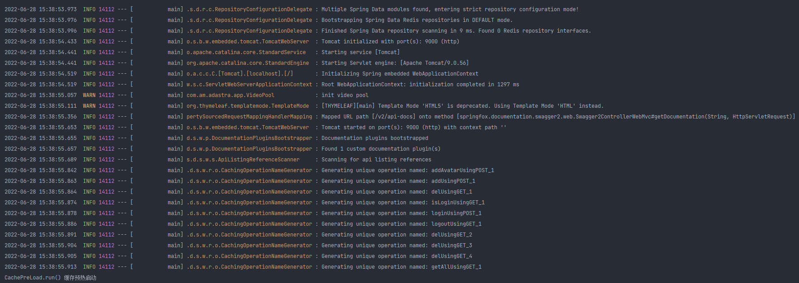
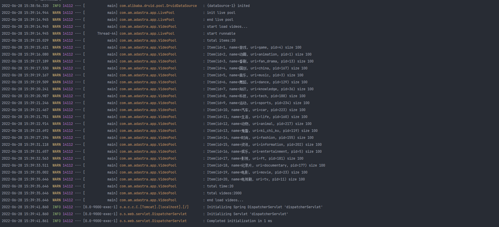
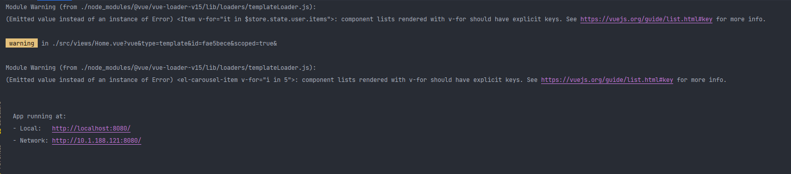

# [ad-astra 视频网站V1.0（项目汇报版）](http://adastra.isamumu.cn/#/)

 项目持续维护中.......

[前端地址](https://gitee.com/arturiamu/libilibi-web) | [后端地址](https://gitee.com/arturiamu/libilibi-host.git)

## 关于`ad-astra`

`ad-astra`是一个由基于`前后端分离`架构的**个性化视频推荐**网站，该网站收录了B站内包含舞蹈、音乐、动画、电影等在内的20种类型、共计20余万条视频
和大量实时直播，供用户免费观看，同时也实现了用户对视频的点赞、收藏和用户间的交流功能，用户个人主页、会员功能，以及管理员对用户、视频的管理功能。

更多功能持续更新中...

## 技术清单

### 前端

- 使用`vue-cli`开发
- 使用`element-ui`组件库渲染页面
- 使用`axios`进行数据交互
- 使用`echarts`绘制图像

### 后端

- 使用`SpringBoot`框架开发
- 使用`validation`进行基本数据格式验证
- 使用`MySQL`+`MyBatis`+`druid`实现数据持久化
- 使用`Redis`实现缓存
- 使用`Session`实现用户识别、权限验证
- 使用`tencentcloudapi`+`qcloudsms`发送短信，配合`Session`实现短信验证
- 使用`spring-boot-starter-mail`发送邮件，配合`Session`实现邮件验证
- 使用`thymelea`解析邮件模板
- 使用`aliyun-oss`实现对象存储
- 使用`alipay`沙箱支付实现模拟交易
- 使用`hutool`实现excel操作数据
- 使用`knife4j`在线文档协调前后端数据交互

## 项目规模

项目共计使用15张数据表、57个api接口

## 快速开始

### 需求

- 你需要安装`mysql 8.0.29`或其他能够兼容此版本的`mysql`数据库
- 你需要安装`Redis 3.2.100`或其他能够兼容此版本的`Redis`数据库
- 你需要申请腾讯云短信服务接口
- 你需要申请支付宝沙箱支付服务接口
- 你需要配置一个支持`smtp`协议的QQ邮箱
- 你的 `PATH` 环境变量必须包含所需要的构建工具，如`Tomcat`、`Maven`

- 你需要安装`Node.js`并能正常使用`npm`包管理器下载项目所需依赖

### 修改配置文件

#### 提示

- 此网站个性化推荐使用协同过滤算法，该算法需要一定的数据量支撑才能实现精准推荐
- 此网站数据库文件较大，本地部署可能会出现SQL文件太大导致数据库导入失败等问题
- 此网站注册功能需要验证手机号或邮箱，因此需要配置`阿里云短信服务接口`和`spring-boot-starter-mail`

综上所述，为了更好的体现出推荐算法以及方便部署演示，推荐使用***默认配置文件***，如需查看数据库文件，使用可视化工具连接以下数据库

```yml
url: 175.24.175.35:3306
databases: adastra
username: teacher
password: teacher
```

#### 默认配置

注意：使用默认配置时主要业务功能由服务器处理，但`Redis`缓存需要保存在本地，所以仍然需要配置本地`Redis`

若使用远程默认`MySQL`，由于网络原因加载大量视频数据需要较长时间，可通过修改`resources -> mapper -> VideoMapper`文件下的
`getById`方法添加`limite`来查询部分视频，以加快项目启动速度
```yml
server:
  port: 9000
  address: 0.0.0.0
  servlet:
    encoding:
      force: true
      charset: UTF-8
spring:
  mvc:
    static-path-pattern: /static/**
  jackson:
    defaultPropertyInclusion: non_null
    deserialization:
      fail_on_unknown_properties: false
  datasource:
    driver-class-name: com.mysql.cj.jdbc.Driver
    url: jdbc:mysql://175.24.175.35:3306/adastra?characterEncoding=utf-8&serverTimezone=Asia/Shanghai
    username: teacher
    password: teacher
    type: com.alibaba.druid.pool.DruidDataSource
  redis:
    host: localhost
    port: 6379
    # 默认redis密码为空
    password:
    database: 0
    timeout: 1800000
    lettuce:
      cluster:
        refresh:
          adaptive: true
          period: 60s
      pool:
        max-active: 20
        max-wait: -1
        max-idle: 5
        min-idle: 1
  mail:
    host: smtp.qq.com
    username: 2762404119@qq.com
    password: wopenrzwqnfhdhdh
    default-encoding: utf-8
    port: 465
    properties:
      mail.smtp.ssl.enable: true
    protocol: smtps
  thymeleaf:
    prefix: classpath:/templates/
    suffix: .html
    mode: HTML5
    encoding: UTF-8
    servlet:
      content-type: text/html
    cache: false
sms:
  app:
    id: 1400683116
    key: 95f32e5cdb35bbc88dbcedb41b6934e4
    template:
      universal: 1419186
    sign: isamumu
  size: 6

aliyun:
  oss:
    file:
      endpoint: oss-cn-hangzhou.aliyuncs.com
      keyId: LTAI5tJTSkD8cSxk1dazEqLV
      keysecret: 0iN9FRV610rfHP5bfzKVuZxIcCdlc5
      bucketname: libilibi-host

mybatis:
  mapper-locations: classpath*:mapper/*Mapper.xml
  type-aliases-package: com.am.adastra.entity
  configuration:
    cache-enabled: true
    map-underscore-to-camel-case: true
logging:
  level:
    com:
      am:
        adastra: warn
knife4j:
  enable: true
```

#### 个性化配置

若在本地部署后端项目，你需要做如下准备：

- 安装`mysql 8.0.29`，将有足够权限的用户名及密码配置到`application.yml`文件`spring: datasource`属性下

- 新建数据库`adastra`，设置字符编码和检验为支持中文编码的字符，如`utf-8`
- 使用`adastra`数据库，在此数据库上执行`adastra.sql`文件，注意此过程中可能会以为SQL文件过大而导致执行失败，需根据不同数据库版本做相应设置
- 安装`Redis 3.2.100`，将用户名及密码配置到`application.yml`文件`spring: redis`属性下
- 准备一个支持`smtp`协议的邮箱，将用户名及密码等属性配置到`application.yml`文件`spring: mail`属性下
- 申请一个腾讯云短信服务接口，将`appid`、`appkey`、`sign`等属性配置到`application.yml`文件`sms`属性下
- 申请一个阿里云对象存储服务接口，将`keyId`、`keysecret`等属性配置到`application.yml`文件`aliyun`属性下

### 运行

#### 后端

使用idea打开前端项目，确保配置文件正确无误，刷新Maven，下载项目所需全部依赖，运行项目启动类，出现如下界面则表示项目运行成功：

注意：由于项目启动需要加载大量数据，整个项目运行需要3-8分钟，启动过程中若无报错，请耐心等待

若使用本地部署`MySQL`，可大大加快数据读取过程，可通过修改`resources -> mapper -> VideoMapper`文件下的
`getById`方法取消`limite`来查询全部视频，以获取最佳使用体验




#### 前端

使用idea打开项目，打开idea项目终端，使用`npm install`命令安装项目所需文件，安装完成后使用`npm run serve`命令运行项目，若出现如下界面，则说明前端运行成功，使用浏览器打开命令行所提示的网址即可访问：



#### 前端注意事项

前端项目所有`http`请求调用由`http.js`封装的`httpGet`和`httpPost`方法，所有请求默认访问`localhost:9000`若后端修改了运行端口，需要同时修改`https.js`文件中的`requestUrl`属性值为`http://localhost:`+`端口号`

## todo list

- 根据会员等级不同，提供不同的服务
- 跟精确的个性化推荐
- 用户间互相关注
- 用户间相互发私信
- 用户自己上传视频
- 直播功能
